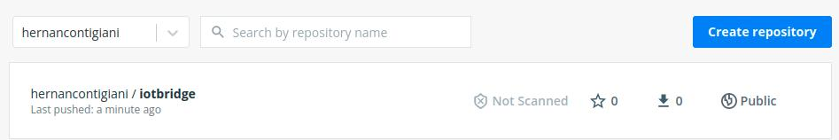

# Ejemplos de clase

En esta práctica subiremos nuestra imagen de iotbridge a dockerHub

Logearse desde VM y obtener cual es la dirección IP del dispositivo:
```sh
$ ifconfig
```

Para estar práctica se recomienda tener el VSC abierto (open folder) en la carpeta "ejemplo_4" que se encuentra dentro de "ejemplos_clase".

### 1 - Logearse en dockerhub
Primero debe tener un usuario creado de dockerhub, y la imagen del iotbridge lleve comenzar con el nombre de ese usuario.

Logearse a dockerhub:
```sh
$ docker login -u <usuario_dockerhub>
```

### 2 - Subir una imagen a dockerhub
Debe ingresar el nombre completo de la imagen, incluida la versión (que en este caso será latest).

Puede buscar el nombre de la imagen deseada a subir con:
```sh
$ docker image list
```

Subir imagen a dockerhub
```sh
$ docker push <usuario_dockerhub>/iotbridge:latest
```

Verá durante la subida que habrá muchos mensajes de este estilo:
```
0804a4895ec9: Mounted from library/python
```
Esto quiere decir que dockerHub está tomando la imagen de Python nuestra de su actual hub, por ende no se está duplicando la información de esa imagen.

Ingresar a su dockerHub y verificar que la imagen se haya subido correctamente:




### 3 - Ensayar
A fin de poder ensayar que ahora contamos con la imagen de respaldo en la nube...

Comezar por borrar la imagen actual en nuestro disco:
```sh
$ docker rmi <usuario_dockerhub>/iotbridge:latest --force
```

Borrar todo cache de imagenes:
```sh
$ sudo docker rmi $(sudo docker images -f "dangling=true" -q) --force
```

Ingresar a la carpeta del ejemplo_4, y dentro del docker-compose dejar comentada la siguiente linea:
```dockerfile
#build: ./iotbridge
```

Ahora el docker-compose no tendrá más remedio que buscar la imagen en la nube, ya que no sabe donde está el Dockerfile.

Lanzar el docker-compose dentro de la carpeta ejemplo_4 y observar como el sistema utiliza dockerHub para descargar la imagen:
```sh
$ docker-compose up
```

Verá un mensaje como el siguiente:
```
Pulling iotbridge (<usuario_dockerhub>/iotbridge:latest)...
latest: Pulling from <usuario_dockerhub>/iotbridge
```
